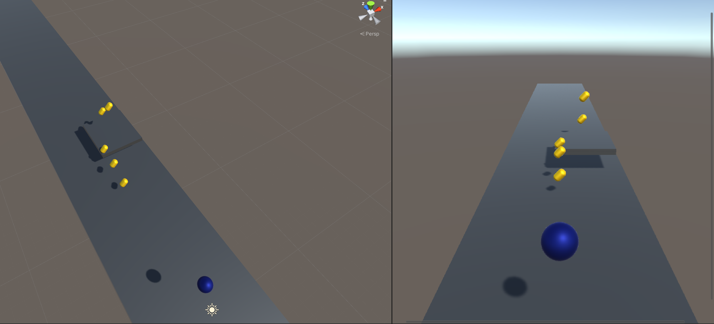

# Tutorial 3D Example 1

## Scripts 

1. Player 
   * keobard move + jump
   * trigger item -> Off
2. Item  
    * rotation 
3. Camera
    * set position based on the player position 
4. GameManager
    * reset game when it collides with the player. 

